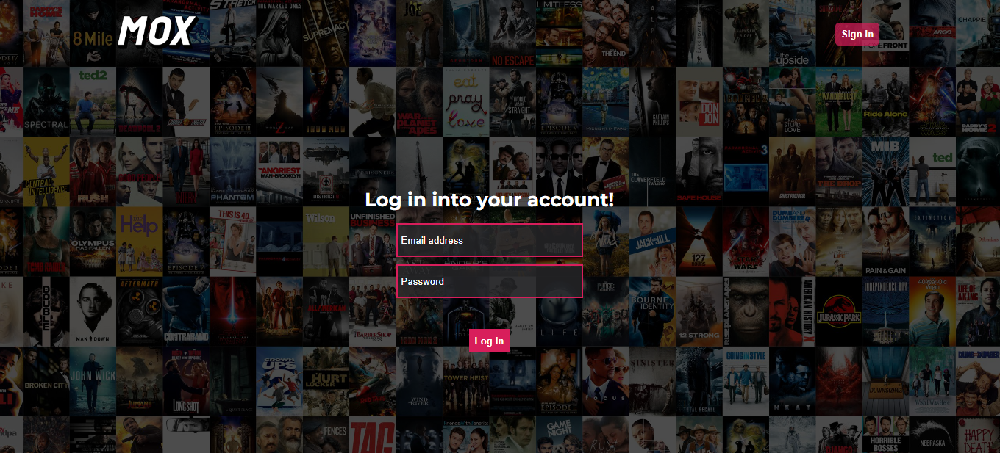
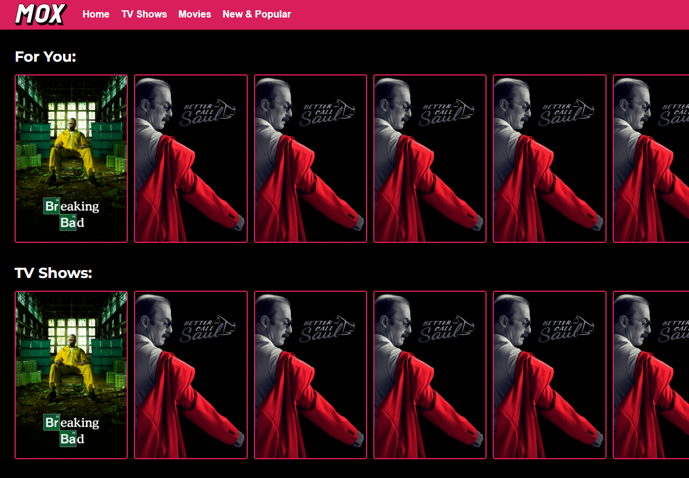
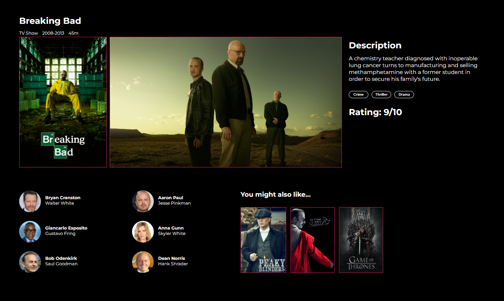

<!DOCTYPE html>
<html lang="ro">
<head>
    <meta charset="UTF-8">
</head>
<body>
<article>
    <header>
        <h1>
            MoX (Movies and TV Shows Explorer)
        </h1>
    </header>
    <h2>Cuprins</h2>
    <ul>
        <li>
            <a href="#authors">Autori</a>
        </li>
        <li>
            <a href="#introduction">1. Introducere</a>
            <ul>
                <li><a href="#introduction-purpose">1.1 Scop</a></li>
                <li><a href="#conventions">1.2 Convenție de scriere</a></li>
                <li><a href="#audience">1.3 Publicul țintă</a></li>
                <li><a href="#product-scope">1.4 Scopul produsului</a></li>
                <li><a href="#references">1.5 Referințe</a></li>
            </ul>
        </li>
        <li><a href="#overall">2. Descriere Generală</a>
            <ul>
                <li><a href="#product-perspective">2.1 Perspectiva produsului</a></li>
                <li><a href="#product-functions">2.2 Funcțiile produsului</a></li>
                <li><a href="#users">2.3 Clase și caracteristici ale utilizatorilor</a></li>
                <li><a href="#operating-environment">2.4 Mediul de operare</a></li>
                <li><a href="#documentation">2.5 Documentația pentru utilizator</a></li>
            </ul>
        </li>
        <li><a href="#external">3. Interfețele aplicației </a>
            <ul>
                <li><a href="#user-interface">3.1 Interfața utilizatorului </a>
                    <ul>
                        <li><a href="#nav-bar">3.1.1 Bara de navigație </a></li>
                        <li><a href="#login-page">3.1.2 Pagina de autentificare </a></li>
                        <li><a href="#signup-page">3.1.3 Pagina de înregistrare </a></li>
                        <li><a href="#sendMail-page">3.1.4 Pagina de trimitere email pentru resetarea parolei</a></li>
                        <li><a href="#resetPassword-page">3.1.5 Pagina de resetarea parolei</a></li>
                        <li><a href="#home-page">3.1.6 Pagina de acasă </a></li>
                        <li><a href="#learning">3.1.7 Pagina de învățare</a></li>
                        <li><a href="#rules">3.1.8 Pagina cu legislația</a></li>
                        <li><a href="#signs">3.1.9 Pagina cu semnele de circulație</a></li>
                        <li><a href="#tests">3.1.10 Pagina Pagina de chestionare </a></li>
                        <li><a href="#about">3.1.11 Pagina informativa </a></li>
                        <li><a href="#help">3.1.12 Pagina de ajutor </a></li>
                        <li><a href="#profile">3.1.13 Pagina de profil </a></li>
                        <li><a href="#error400">3.1.14 Pagina 400 </a></li>
                        <li><a href="#error404">3.1.15 Pagina 404 </a></li>
                        <li><a href="#admin">3.1.16 Pagina administratorului </a></li>
                        <li><a href="#changepass">3.1.17 Pagina de schimbare a parolei </a></li>
                    </ul>
                </li>
                <li><a href="#hardware-interface">3.2 Interfața Hardware </a></li>
                <li><a href="#software-interface">3.3 Interfața Software</a></li>
                <li><a href="#communication-interface">3.4 Interfața de comunicare</a></li>
            </ul>
        </li>
        <li><a href="#system-features">4. Caracteristici ale sistemului</a>
            <ul>
                <li><a href="#management">4.1 Gestionarea contului </a>
                    <ul>
                        <li><a href="#management-1">4.1.1 Descriere și generalități </a></li>
                        <li><a href="#management-2">4.1.2 Actualizarea informațiilor</a></li>
                        <li><a href="#management-3">4.1.3 Condiții de funcționare</a></li>
                    </ul>
                </li>
                <li><a href="#utilizatori">4.2 Secțiunea Utilizatori</a>
                    <ul>
                        <li><a href="#utilizatori-1">4.2.1 Descriere și generalități</a></li>
                        <li><a href="#utilizatori-2">4.2.2 Actualizarea informațiilor</a></li>
                        <li><a href="#utilizatori-3">4.2.3 Condiții de funcționare</a></li>
                    </ul>
                </li>
                <li><a href="#administrator">4.3 Secțiunea Admin</a>
                    <ul>
                        <li><a href="#administrator-1">4.3.1 Descriere și generalități</a></li>
                        <li><a href="#administrator-2">4.3.2 Actualizarea informațiilor</a></li>
                        <li><a href="#administrator-3">4.3.3 Condiții de funcționare</a></li>
                    </ul>
                </li>
                <li><a href="#logout">4.4 Secțiunea Logout</a>
                    <ul>
                        <li><a href="#logout-1">4.4.1 Descriere și generalități</a></li>
                        <li><a href="#logout-2">4.4.2 Actualizarea informațiilor</a></li>
                        <li><a href="#logout-3">4.4.3 Condiții de funcționare</a></li>
                    </ul>
                </li>
                <li><a href="#other">4.5 Alte funcționalități </a>
                    <ul>
                        <li><a href="#other-1">4.5.1 Descriere și generalități</a></li>
                        <li><a href="#other-2">4.5.2 Actualizarea informațiilor</a></li>
                        <li><a href="#other-3">4.5.3 Condiții de funcționare</a></li>
                    </ul>
                </li>
            </ul>
        </li>
        <li><a href="#non-functional">5.Funcționalități pentru protecție și securitate</a>
            <ul>
                <li><a href="#safety">5.1 Protecția datelor</a></li>
                <li><a href="#security">5.2 Securizarea datelor</a></li>
                <li><a href="#software-attributes">5.3 Calitățile Software </a></li>
            </ul>
        </li>
    </ul>
    

        <section id="authors" typeof="sa:AuthorsList">
            <h2>Autori</h2>
            <ul>
                <li property="schema:author" typeof="sa:ContributorRole">
            
              <meta content="Roberto" property="schema:givenName">
              <meta content="Palici" property="schema:familyName">
              Palici Roberto
            
                    <ul>
                        <li property="schema:roleContactPoint" typeof="schema:ContactPoint">
                            <a href="mailto:palici.roberto@gmail.com" property="schema:email">palici.roberto@gmail.com</a>
                        </li>
                    </ul>
                </li>
                <li property="schema:author" typeof="sa:ContributorRole">
            
              <meta content="Lucian" property="schema:givenName">
              <meta content="Andrei" property="schema:additionalName">
              <meta content="Cucuteanu" property="schema:familyName">
              Cucuteanu Lucian Andrei
            
                    <ul>
                        <li property="schema:roleContactPoint" typeof="schema:ContactPoint">
                            <a href="mailto:lucian.andrei68@gmail.com" property="schema:email">lucian.andrei68@gmail.com</a>
                        </li>
                    </ul>
            </ul>
        </section>
    

    <section id="introduction">
        <h3>1. Introducere</h3>
        <section id="introduction-purpose">
            <h4>1.1 Scop</h4>
            

                MoX (Movies and TV Shows Explorer) este o aplicație web dezvoltată de studenții menționați în secțiunea
                de Autori de la Facultatea de
                Informatică a Universității Alexandru Ioan Cuza.
                Scopul acestui document este acela de a prezenta o descriere detaliată a funcționalităților, precum și
                de a
                specifica cerințele aplicației web. Această aplicație va oferi utilizatorilor posibilitatea de a vedea librăria de filme și seriale TV disponibile pe site-urile de streaming Netflix și Disney+.
                De asemenea, utilizatorilor le sunt oferite detalii despre aceste filme sau seriale TV.
            

        </section>
        <section id="conventions">
            <h4> 1.2 Convenția documentului</h4>
            <ul>
                <li>
                    Acest document urmează șablonul de documentație a cerințelor software conform IEEE Software
                    Requirements
                    Specification.
                </li>
                <li>
                    Textul <b>îngroșat</b> este folosit pentru a defini noțiuni personalizate sau pentru a accentua
                    concepte
                    importante.
                </li>
            </ul>
        </section>
        <section id="audience">
            <h4>1.3 Publicul țintă</h4>
            

                Acest document este destinat tuturor utilizatorilor,
                indiferent
                de cunoștințele lor tehnologice,
                poate consulta secțiunile de <b>Home Page</b> și <b>Start Page</b>
                pentru a
                obține o mai bună înțelegere a ceea ce oferă aplicația.
            

        </section>
        <section id="product-scope">
            <h4>1.4 Scopul Produsului</h4>
            

                Scopul aplicației este acela de a pune la dispozitia utilizatorilor diferite informatii despre filmele si serialele TV care apartin platformelor Netflix si Disney+.
                Utilizatorii pot accesa diferite filme sau seriale TV, unde pot afla informatii precum: numarul de episoade, durata unui episod, perioada de difuzare, rating, trailer, poster,
                actorii participanti si recomandari. De asemenea, utilizatorii își pot crea un cont
                pentru a
                beneficia de restul funcționalităților MoX.
            

        </section>
        <section id="references">
            <h4>1.5 Bibliografie</h4>
            <ul>
                <li>Daniel Isepciuc, Site-ul Tehnologii Web, FII UAIC</li>
                <li>H Rick. IEEE-Template - GitHub</li>
            </ul>
        </section>
    </section>
    <section id="overall">
        <h3>2. Descriere Generală</h3>
        <section id="product-perspective">
            <h4>2.1 Perspectiva produsului</h4>
            
MoX (Movies and TV Shows Explorer) este o aplicație dezvoltată în cadrul cursului de Tehnologii Web,
                menită să
                ofere un mod de a vizualiza libraria de seriale TV si filme puse la dispozitie de site-urile de streaming Netflix si Disney+.
        </section>
        <section id="product-functions">
            <h4>2.2 Funcționalitățile produsului</h4>
            Fiecare utilizator va avea acces la urmatoarele funcționălități:
            <ul>
                <li>să acceseze pagina "Start Page" pentru a se inregistra</li>
                <li>să acceseze pagina "LogIn Page" pentru a se autentifica</li>
                <li>să consulte pagină "Home Page" și noutățile disponibile</li>
                <li>să acceseze pagina "Home Page" pentru a vizualiza liste organizate dupa categorii de filme si seriale TV.</li>
                <li>să acceseze pagina "Despre" pentru a accesa scurtă descriere a paginii web</li>
                <li>să acceseze pagina "Ajutor" pentru a beneficia de sfaturi în vederea utilizării aplicației</li>
                <li>dacă este <b>autentificat</b>, să acceseze pagină "Home Page" și să vizualizeze listele precizate anterior</li>
                <li>dacă este <b>autentificat</b>, să acceseze pagină "Movie Page" și să vizualizeze informatii detaliate despre un anumit film sau serial TV</li>
                <li>dacă utilizatorul are rol de <b>admin</b>, acesta poate șterge utilizatori din baza de date</li>
                <li>dacă utilizatorul are rol de <b>admin</b>, acesta poate adăuga filme sau seriale TV noi</li>
            </ul>
        </section>
        <section id="users">
            <h4>2.3 Clase și caracteristici ale utilizatorilor</h4>
            <h5>2.3.1 Utilizator principal</h5>
            <ul>
                <li>utilizatorii autentificați pot fi:</li>
                <li style="list-style: none">
                    <ul>
                        <li>orice categorie de oameni care doresc să afle informatii in legatura cu anumite filme sau seriale TV.
                        </li>
                    </ul>
                </li>
                <li>
                    utilizatorii neautentificați pot fi:
                    <ul>
                        <li>orice persoana indiferent de categoria de varsta.
                        </li>
                    </ul>
                </li>
            </ul>
            <h5>2.3.2 Caracteristici</h5>
            <ul>
                <li>Utilizatorii care sunt <b> autentificați </b> pot accesa pagină de "Home Page", de "Movie Page",
                    dar și cele două pagini ce oferă detalii și sfaturi cu privire la aplicație, "Despre" și "Ajutor".
                    Mai mult, aceștia pot accesa anumite filme sau seriale TV, pot lasa recenzii si note.
                </li>
                <li>Utilizatorii care nu sunt autentificați pot să vizualizeze doar paginile de "Start Page" si "Movie Page", in care pot cauta detalii despre filme si seriale TV.
                </li>
            </ul>
        </section>
        <section id="operating-environment">
            <h4>2.4 Mediul de operare</h4>
            

                Produsul dezvoltat poate fi utilizat pe orice dispozitiv cu un browser web care suportă HTML5, CSS și
                JavaScript.
            

        </section>
        <section id="documentation">
            <h4>2.5 Documentația pentru utilizator</h4>
            

                Utilizatorii pot consulta acest document pentru explicații detaliate despre funcționalitățile aplicației
                web.
            

        </section>
    </section>
    <section id="external">
        <h3>3. Interfețele aplicației</h3>
        <section id="user-interface">
            <h4>3.1 Interfața utilizatorului</h4>
            Mai jos, puteți vedea o prezentare generală a fiecărei pagini a aplicației și funcționalităților pe care le
            oferă:
            <ul>
                <li id="nav-bar"><b>Bara de navigație</b></li>
                <li style="list-style: none">
                    <ul>
                        <li>Aceasta reprezintă meniul de navigare către fiecare pagina a aplicației, prezent pe fiecare
                            pagină totodată.
                        </li>
                        <li class="pictures" style="list-style: none"></li>
                    </ul>
                </li>
                <li id="login-page"><b>Pagina de autentificare</b></li>
                <li style="list-style: none">
                    <ul>
                        <li>Pagina are rolul de a realiza autentificarea utilizatorilor la MoX.</li>
                        <li>Pentru a se autentifica, utilizatorul trebuie să completeze câmpurile de "E-mail" și
                            "Password" cu
                            credențiale <b>valide</b>, urmând să acționeze butonul <b>Log In</b>.
                        </li>
                        <li> În cazul în care utilizatorul nu are cont pe site, acesta își poate crea unul prin
                            accesarea pagini de
                            înregistrare, ce se face prin apăsarea butonului <b>Register</b>.
                        </li>
                        <li class="pictures" style="list-style: none">
                        </li>
                    </ul>
                </li>
                <li id="signup-page"><b>Pagina de înregistrare</b></li>
                <li style="list-style: none">
                    <ul>
                        <li>Pagina oferă funcționalitatea de înregistrare a utilizatorilor, pentru a putea beneficia de
                            toate
                            funcționalitățile RoT.
                        </li>
                        <li>Pentru a se înregistra, utilizatorul trebuie să completeze câmpurile <b>Email</b>,
                            <b>Nume</b>,
                            <b>Prenume</b>, <b>Nume utilizator</b> și <b>Parola</b>. Mai mult, câmpurile <b>Email</b> și
                            <b>Nume utilizator</b>
                            trebuie să fie <b>unice</b>.
                        </li>
                        <li>În cazul în care utilizatorul își amintește că are un cont existent, acesta poate apasă
                            butonul
                            <b>Autentificare</b> aflat în partea de jos a formularului, sau pe butonul <b>Login</b> din
                            coltul din dreapta-sus
                            al paginii, pentru a reveni la meniul de autentificare.
                        </li>
                        <li class="pictures" style="list-style: none">
                    </ul>
                </li>
                <li id="home-page"><b> Home Page</b></li>
                <li style="list-style: none">
                    <ul>
                        <li>Pagina are rolul de prezența liste de filme si seriale TV in functie de diferite categorii.</li>
                        <li class="pictures" style="list-style: none">
                        </li>
                    </ul>
                </li>
                <li id="rules"><b>Movie Page</b></li>
                <li style="list-style: none">
                    <ul>
                        <li>Pagina conține detalii ample legate de anumite filme sau seriale TV cautate de utilizatori.</li>
                        <li class="pictures" style="list-style: none">
                        </li>
                    </ul>
                <li id="about"><b>Pagina informativa</b></li>
                <li style="list-style: none">
                    <ul>
                        <li>Pagina are rolul de a introduce site-ul RoT pe scurt, prin menționarea unor mici detalii:
                            tehnologii
                            utilizate, numele autorilor, scopul aplicației și bibliografia.
                        </li>
                        <li class="pictures" style="list-style: none">
                        </li>
                    </ul>
                <li id="help"><b>Pagina de ajutor</b></li>
                <li style="list-style: none">
                    <ul>
                        <li>Pagina are rolul de a prezenta câteva sfaturi pentru a putea beneficia de o experienta
                            completa pe site.
                        </li>
                        <li class="pictures" style="list-style: none">
                        </li>
                    </ul>
            </ul>
            <section id="hardware-interface">
                <h4>3.2 Interfața Hardware</h4>
                

                    Acest produs nu necesită interfețe hardware, funcționând pe orice platformă (calculatoare,
                    laptopuri,
                    telefoane etc.), care are instalată un browser.
                

            </section>
            <section id="software-interface">
                <h4>3.3 Interfața Software</h4>
                

                    Cerințele minime de software includ un browser funcțional, compatibil cu HTML5 și cu JavaScript.
            </section>
            <section id="communication-interface">
                <h4>3.4 Interfața de comunicare</h4>
                

                    Aplicația necesită o conexiune la internet. Standardul de comunicare care va fi utilizat este HTTP.
                

            </section>
            <section id="system-features">
                <h3>4. Caracteristici ale sistemului</h3>
                <section id="management">
                    <h4>4.1 Gestionarea contului</h4>
                    <h5 id="management-1">4.1.1 Descriere și generalități</h5>
                    Un utilizator se poate înregistra alegându-și un nume de utilizator, un E-mail, o parola, numele si
                    prenumele.
                    Acesta se poate
                    autentifica având nevoie doar de E-mail și de parolă.
                    <h5 id="management-2">4.1.2 Actualizarea informațiilor</h5>
                    <ul>
                        <li>
                            În momentul în care un utilizator nou este creat, credențialele acestuia sunt introduse în
                            baza de
                            date. De asemenea, când utilizatorul decide să-și modifice credențialele, noile valori sunt
                            și ele
                            actualizate în baza de date.
                        </li>
                    </ul>
                    <h5 id="management-3">4.1.3 Condiții de funcționare</h5>
                    <ul>
                        <li>
                            Pentru a-și modifica credențialele utilizatorul, trebuie să fie autentificat.
                        </li>
                        <li>
                            Pentru a se autentifica, utilizatorul are nevoie de un cont care este înregistrat în baza de
                            date.
                        </li>
                    </ul>
                </section>
                <section id="utilizatori">
                    <h4>4.2 Secțiunea de utilizatori</h4>
                    <h5 id="utilizatori-1">4.2.1 Descriere și generalități</h5>
                    Secțiunea <b>Utilizatori</b> este destinată
                    <b>adminului</b>, și aceasta îi oferă posibilitatea
                    de a vizualiza o listă cu toți utilizatorii din
                    baza de date. De asemenea, acesta are posibilitatea
                    de a elimina utilizatori din baza de date, dacă
                    dorește acest lucru.
                    <h5 id="utilizatori-2">4.2.2 Actualizarea informațiilor</h5>
                    <ul>
                        <li>
                            La apăsarea butonului de ștergere din dreptul fiecărui utilizator, credențialele
                            utilizatorului care a
                            fost selectat, sunt șterse din baza de date.
                        </li>
                    </ul>
                    <h5 id="utilizatori-3">4.2.3 Condiții de funcționare</h5>
                    <ul>
                        <li>
                            Utilizatorul trebuie să fie autentificat.
                        </li>
                        <li>
                            Utilizatorul trebuie să dețină drepturi de admin.
                        </li>
                    </ul>
                </section>
                <section id="administrator">
                    <h4>4.3 Secțiunea Admin</h4>
                    <h5 id="administrator-1">4.3.1 Descriere și generalități</h5>
                    Secțiunea <b>Admin</b> este destinată utilizatorilor ce au drepturi de <b>administrator</b> și
                    această
                    oferă facilități pe care un utilizator normal nu le are. În momentul în care adminul accesează
                    panoul de control,
                    va putea adaugă/modifică detalii despre anumite filme si seriale TV. Totodată, acesta este
                    capabil să șteargă
                    conturi ale utilizatorilor.
                    <h5 id="administrator-2">4.3.2 Actualizare informațiilor</h5>
                    <ul>
                        <li>
                            În momentul în care adminul adaugă o informatie despre un film sau serial TV, detaliile
                            acestea sunt inserate
                            în baza de
                            date.
                        </li>
                    </ul>
                    <h5 id="administrator-3">4.3.3 Condiții de funcționare</h5>
                    <ul>
                        <li>
                            Utilizatorul trebuie să fie autentificat.
                        </li>
                        <li>
                            Utilizatorul trebuie să dețină drepturi de admin.
                        </li>
                    </ul>
                </section>
                <section id="logout">
                    <h4>4.4 Secțiunea de Logout</h4>
                    <h5 id="logout-1">4.4.1 Descriere și generalități</h5>
                    Secțiunea de <b>Logout</b> are rolul de a deconecta utilizatorul de pe cont și îl redirecționează
                    către
                    pagina acasă.
                    <h5 id="logout-2">4.4.2 Actualizare informațiilor</h5>
                    <ul>
                        <li>
                            Tokenul de autentificare este eliminat, prin intermediul JWT.
                        </li>
                    </ul>
                    <h5 id="logout-3">4.4.3 Condiții de funcționare</h5>
                    <ul>
                        <li>
                            Utilizatorul trebuie să fie autentificat.
                        </li>
                    </ul>
                </section>
            </section>
            <section id="non-functional">
                <h3>5. Funcționalități pentru protecție și securitate</h3>
                <section id="safety">
                    <h4>5.1 Protecția datelor</h4>
                    

                        Aplicația va asigura confidențialitatea datelor prin intermediul unei criptări.
                    

                </section>
                <section id="security">
                    <h4>5.2 Securizarea datelor</h4>
                    

                        Autorizarea utilizatorilor se face pe baza standardului JWT. Utilizatorii au acces doar la
                        informații legate
                        de progresul in cadrul site-ului, celelalte informații fiind ascunse. Token-ul folosit pentru
                        autorizare este
                        stocat intr-un cookie de tip HTTP-only, lucru care previne atacurile de tip XSS. Mai mult, toate
                        datele sunt introduse
                        in baza de date prin intermediul unor <b>prepared statements</b>, care asigura prevenirea SQL
                        Injection.
                    

                </section>
                <section id="software-attributes">
                    <h4>5.3 Calitățile Software</h4>
                    <ul>
                        <li>Adaptabilitate</li>
                        <li>Ușurință în utilizare</li>
                        <li>Flexibilitate</li>
                    </ul>
                </section>
            </section>
        </section>
    </section>
</article>
</body>
</html>
